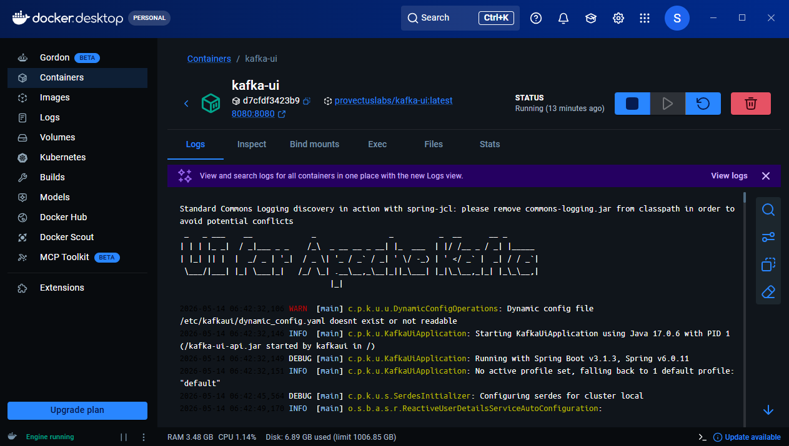
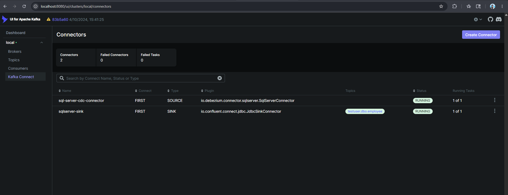
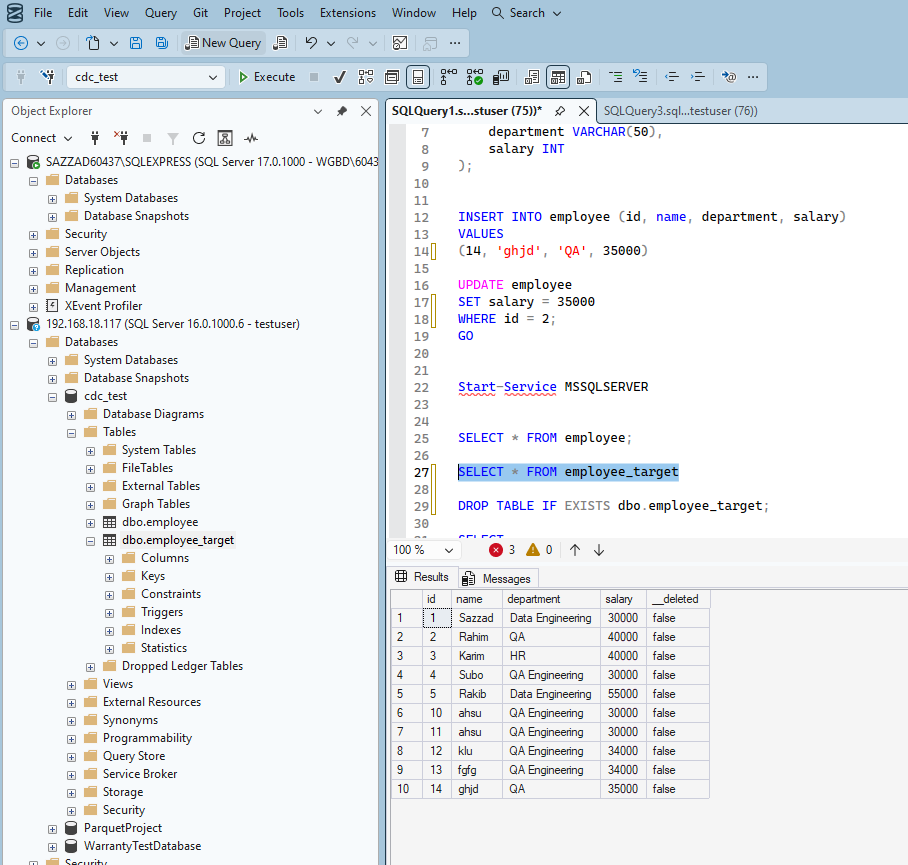

# 🚀 Real-Time CDC pipeline Kafka Debezium sqlserver

This project provides a **real-time data replication pipeline** between SQL Server databases using Change Data Capture (CDC), Apache Kafka, and Debezium connectors. It automatically captures INSERT, UPDATE, and DELETE operations from a source SQL Server table and replicates them to a target SQL Server table with sub-second latency.

